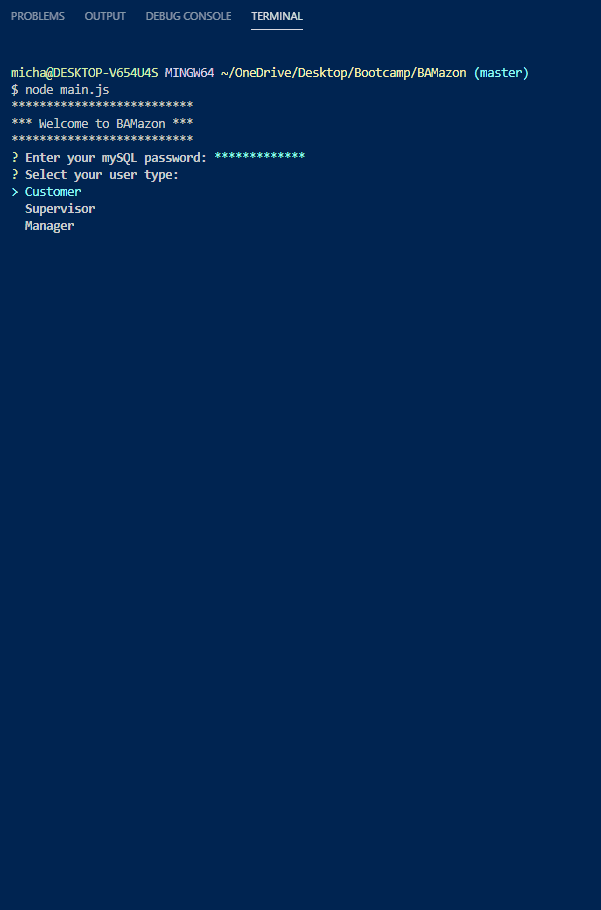
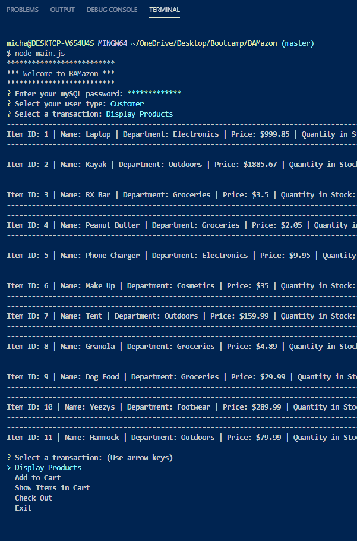
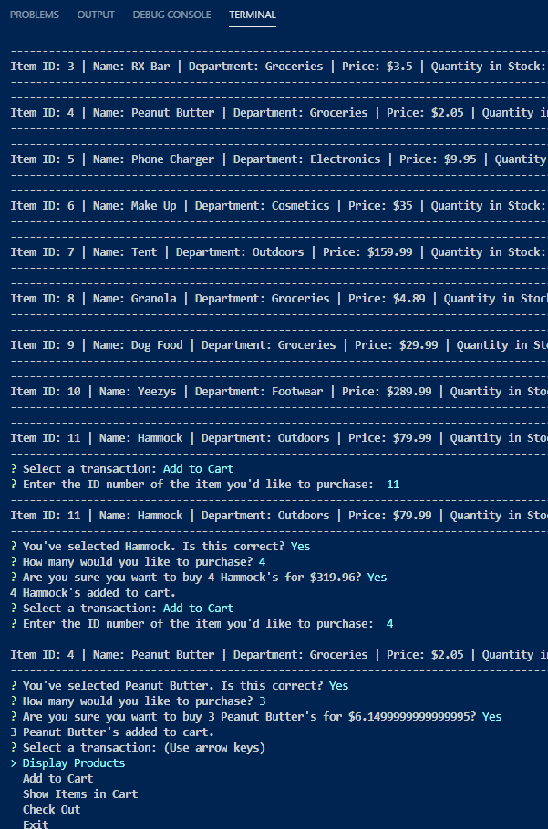
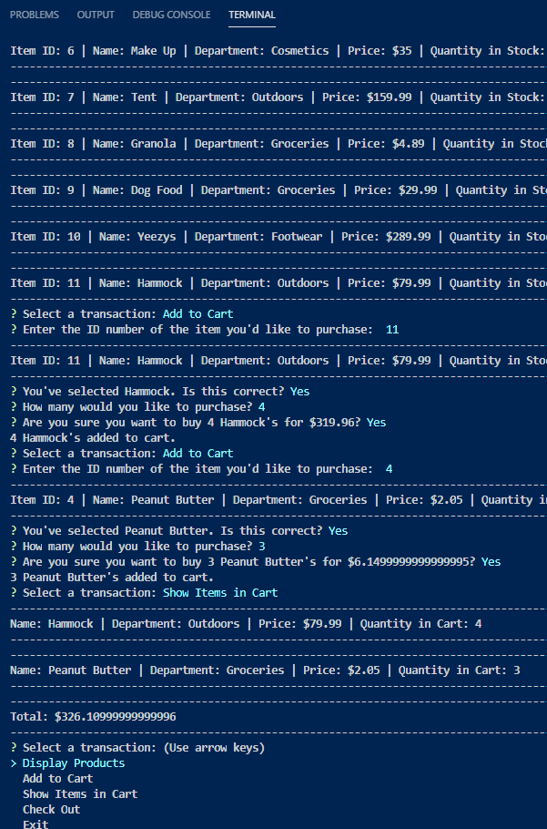
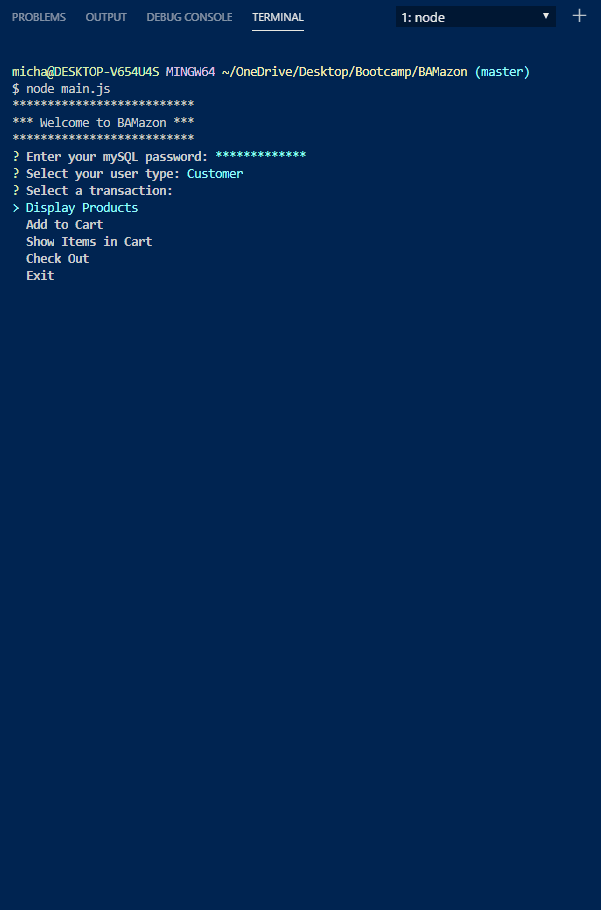
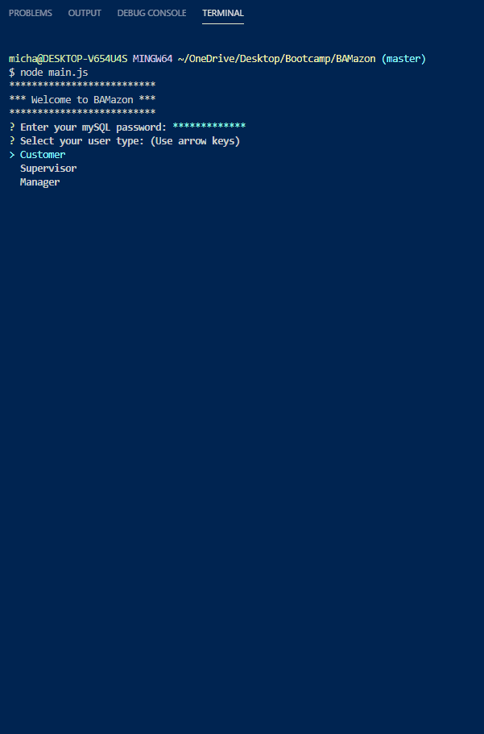

# BAMazon - Command Line Store 
BAMazon is a command line store that carries all of the items you need.

## Overview
BAMazon is a command line node application that takes in a variety of parameters and returns corresponding data. To accomplish this, it utilizes node.js, npm inquirer, SQL, and a mySQL database.

## Installation
1. Clone the repository below
```sh
git clone git@github.com:MR-Stan/BAMazon.git
```
3. Install NPM packages
```sh
npm i
```
4. Run the SQL script in the bamazon.sql file

5. Navigate into the BAMazon folder in node run main.js
```sh
node main.js
```

## Operation
All functions can be reached by answering inquirer prompts. To being the user must enter their mySQL password. From there they can choose from three access levels: Customer, Supervisor, and Manager.


### Customer
* Display Products <br />


* Add to Cart <br />


* Show Items in Cart <br />


* Check Out <br />


* Exit <br />


### Supervisor
* View Sales by Department
<!--  -->

* Add New Department
<!--  -->

* Exit
<!--  -->

### Manager
* View Products for Sale


* View Low Inventory
<!--  -->

* Add to Inventory
<!--  -->

* Add New Product
<!--  -->